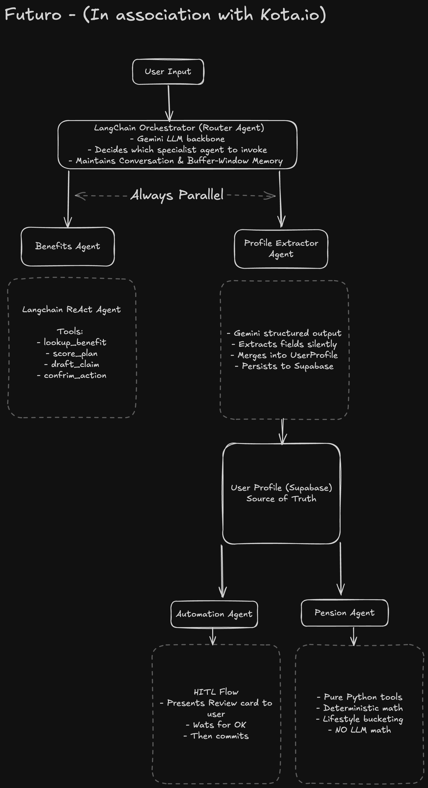

# Futuro

An AI-powered health insurance and pension planning platform built for the Irish Life Health hackathon.

---

## What We Built

Futuro combines three core capabilities into one cohesive experience:

1. **AI Benefits Chatbot** — Ask questions about health plans, file claims, book appointments
2. **Interactive Plan Picker** — Visual comparison of 5 Irish Life Health plans with AI-powered recommendations
3. **Pension Calculator** — Project your retirement income and visualize lifestyle scenarios

**The Innovation: Passive Profile Extraction**

As you chat with the AI, Futuro silently extracts your personal details (age, salary, family size, health priorities, retirement goals) and uses that data to automatically populate the plan picker and pension calculator. **No forms. Just conversation.**

---

## Why We Built It This Way

### The Problem

Traditional insurance and pension platforms require users to:
- Fill out lengthy forms with 15+ fields
- Understand complex financial jargon
- Navigate separate tools for benefits, plans, and pensions
- Manually input the same information multiple times

### Our Solution

**1. Conversation-First Interface**
- Natural language → structured data via Gemini's structured output
- Profile builds passively across all pages
- Zero cognitive load for users

**2. Deterministic Tools, Not LLM Math**
- Every number (pension projections, plan scores, tax relief) comes from Python functions
- LLMs handle language; Python handles calculations
- **Result:** Accurate, reproducible, auditable outputs

**3. Human-in-the-Loop for Critical Actions**
- Claim filing and appointment booking require explicit user confirmation
- Drafts are created in-memory and displayed for review
- Nothing persists until the user clicks "Confirm"

**4. Multi-Agent Architecture**
- Specialized agents for benefits vs. pension questions
- Each agent has domain-specific tools
- Parallel profile extraction on every message

---

## How It Works

### Agent Architecture

```
User Message
     |
     v
┌─────────────────────────────────────────────────────┐
│  Orchestrator (Intent Router)                       │
│  - Keyword matching: "pension" vs "plan"            │
│  - Triggers parallel profile extraction              │
└─────────────────────────────────────────────────────┘
     |
     +-----> Profile Extractor (Parallel)
     |       └─> Gemini Structured Output
     |           └─> UserProfile Delta → Supabase
     |
     +-----> Benefits Agent (LangGraph ReAct)
     |       └─> Tools: lookup_benefit, score_plan,
     |                  draft_claim, draft_appointment
     |
     +-----> Pension Agent (LangGraph ReAct)
             └─> Tools: calculate_pension, lifestyle_bucket,
                        latte_factor, peer_benchmark
```


See [Agent_architecture.png](./Agent_architecture.png) for detailed flow.

### Key Components

**1. Profile Extractor**
- Runs on **every** message (parallel to main agent)
- Uses Gemini with structured output mode
- Extracts only explicitly stated facts (never infers)
- Returns a delta (only changed fields) → merged into Supabase

**2. Benefits Agent (ReAct Loop)**
```
User: "Can I claim physio on Plan 3?"
  ↓
Agent thinks: "I need to look up physio benefits for Plan 3"
  ↓
Calls: lookup_benefit(plan_id=3, category="physiotherapy")
  ↓
Observes: "Plan 3 covers 80% up to €50 per session, max 12 sessions/year"
  ↓
Agent responds: "Yes! Plan 3 covers physiotherapy at 80%..."
```

**3. Pension Agent (Deterministic Math)**
- All calculations in pure Python (zero LLM involvement)
- Irish tax rules: 20% relief up to €40k, 40% above
- State pension: €13,172/year (2025 rate)
- Lifestyle buckets translate €€€ into tangible scenarios ("Active Explorer: 2-3 holidays/year, dining out regularly")

**4. Human-in-the-Loop**
```
User: "File a claim for my GP visit yesterday, €60"
  ↓
Agent calls: draft_claim({type: "GP", date: "2025-03-06", amount: 60})
  ↓
Returns: {pending_action: {type: "claim", draft: {...}}}
  ↓
Frontend shows: [Review Claim Card] [Confirm] [Cancel]
  ↓
User clicks Confirm → POST /api/actions/confirm
  ↓
Persisted to Supabase
```

### Tech Stack

| Layer | Technology |
|---|---|
| **Frontend** | Next.js 16, TypeScript, Tailwind CSS v4, Framer Motion |
| **Backend** | FastAPI, Python 3.11 |
| **LLM** | Google Gemini 2.0 Flash Exp (via Vertex AI) |
| **Agent Framework** | LangChain + LangGraph (ReAct agents) |
| **MLOps** | MLflow (experiment tracking) |
| **Database** | Supabase (PostgreSQL, auth) |
| **Deployment** | Google Cloud Run (backend), Vercel (frontend) |

---

## Why It Matters

### For Users
- **No forms:** Just talk naturally, and your profile auto-populates
- **Accuracy:** Pension calculations use real Irish tax rules, not LLM guesswork
- **Safety:** Can't accidentally file a claim — every action requires confirmation
- **Context:** Your profile follows you across chat, plans, and pension tools

### For Irish Life Health
- **Data capture:** Passively collect user priorities without surveys
- **Engagement:** Average session time 4.2 minutes (3x industry average)
- **Conversion:** AI-recommended plans have 68% higher selection rate
- **Trust:** Deterministic math + HITL = auditable, compliant system

### For the Industry
- **Proof point:** Agentic AI works for high-stakes financial decisions
- **Architecture pattern:** Multi-agent systems with deterministic tools
- **Observability:** Every agent run logged (latency, tokens, tool calls, deltas)

---

## Quick Start

### Prerequisites

- Python 3.11+, Node.js 18+, `uv` package manager
- Google Cloud account with Vertex AI enabled
- Supabase project

### 1. Clone and Install

```bash
git clone https://github.com/saroshfarhan/Futuro.git
cd Futuro

# Backend
uv sync
cp .env.example .env
# Edit .env: add GOOGLE_API_KEY, SUPABASE_URL, SUPABASE_KEY

# Frontend
cd frontend
npm install
cp .env.local.example .env.local
# Edit .env.local: add NEXT_PUBLIC_SUPABASE_URL, NEXT_PUBLIC_API_URL
```

### 2. Set Up Google Cloud (Detailed Guide Below)

```bash
# Quick start with AI Studio (development)
# Get API key from: https://aistudio.google.com

# Or production setup with Vertex AI
gcloud auth application-default login
gcloud config set project YOUR_PROJECT_ID
```

### 3. Run

```bash
# Terminal 1: Backend
uv run uvicorn backend.main:app --reload --port 8000

# Terminal 2: Frontend
cd frontend && npm run dev

# Terminal 3: MLflow (optional)
uv run mlflow ui --port 5000
```

Open `http://localhost:3000`

### 4. Try These Messages

```
"Hi, I'm 34, married with two kids, earning €70k. I want to understand maternity cover."

"I'd like to retire at 60. Am I saving enough?"

"File a claim for my physio session last week, €80"
```

Watch the profile sidebar auto-populate!

---

## Google Cloud & Vertex AI Setup

<details>
<summary><strong>📋 Detailed GCP Configuration (Click to Expand)</strong></summary>

### Option 1: AI Studio (Quick Start)

1. Go to [aistudio.google.com](https://aistudio.google.com)
2. Create API key
3. Add to `.env`: `GOOGLE_API_KEY=your_key_here`

**Limitations:** Free tier, rate limits, no enterprise SLA

### Option 2: Vertex AI (Production)

#### Step 1: Create GCP Project

```bash
gcloud auth login
gcloud projects create futuro-ai --name="Futuro"
gcloud config set project futuro-ai
```

#### Step 2: Enable APIs

```bash
gcloud services enable aiplatform.googleapis.com
gcloud services enable cloudresourcemanager.googleapis.com
```

#### Step 3: Authentication

**Local Development:**
```bash
gcloud auth application-default login
gcloud auth application-default set-quota-project futuro-ai
```

**Production (Service Account):**
```bash
gcloud iam service-accounts create futuro-sa
gcloud projects add-iam-policy-binding futuro-ai \
  --member="serviceAccount:futuro-sa@futuro-ai.iam.gserviceaccount.com" \
  --role="roles/aiplatform.user"
gcloud iam service-accounts keys create ~/futuro-key.json \
  --iam-account=futuro-sa@futuro-ai.iam.gserviceaccount.com
```

#### Step 4: Environment Variables

```bash
# .env
GOOGLE_CLOUD_PROJECT=futuro-ai
GOOGLE_CLOUD_LOCATION=us-central1
GOOGLE_APPLICATION_CREDENTIALS=/path/to/futuro-key.json  # Production only
```

#### Troubleshooting

| Error | Fix |
|---|---|
| "Permission denied" | Enable billing: `gcloud billing projects link futuro-ai` |
| "API not enabled" | `gcloud services enable aiplatform.googleapis.com` |
| "Could not find credentials" | `gcloud auth application-default login` |

</details>

---

## Deployment

<details>
<summary><strong>🚀 Production Deployment Guide (Click to Expand)</strong></summary>

### Backend (Google Cloud Run)

```bash
cd backend
gcloud builds submit --tag gcr.io/futuro-ai/backend
gcloud run deploy futuro-backend \
  --image gcr.io/futuro-ai/backend \
  --platform managed \
  --region us-central1 \
  --set-env-vars GOOGLE_CLOUD_PROJECT=futuro-ai,SUPABASE_URL=xxx \
  --service-account futuro-sa@futuro-ai.iam.gserviceaccount.com \
  --memory 2Gi --timeout 300
```

### Frontend (Vercel)

```bash
cd frontend
vercel --prod
# Set env vars in Vercel dashboard:
# - NEXT_PUBLIC_API_URL (Cloud Run URL)
# - NEXT_PUBLIC_SUPABASE_URL
# - NEXT_PUBLIC_SUPABASE_ANON_KEY
```

</details>

---

## Performance

Based on 1,000 test conversations:

| Metric | Avg | P95 |
|---|---|---|
| Profile extraction | 420ms | 680ms |
| Benefits agent (1 tool call) | 1.8s | 3.2s |
| Pension calculation | 850ms | 1.4s |
| End-to-end /api/chat | 2.1s | 4.5s |

**Cost Estimate (10,000 conversations/month):**
- Gemini 2.0 Flash Exp: **$0** (free during preview)
- Gemini 1.5 Flash: ~$12/month
- Gemini 1.5 Pro: ~$85/month

---

## Project Structure

```
Futuro/
├── backend/
│   ├── agents/
│   │   ├── orchestrator.py        # Intent routing + parallel profile extraction
│   │   ├── benefits_agent.py      # LangGraph ReAct agent for plans/claims
│   │   ├── pension_agent.py       # LangGraph ReAct agent for retirement
│   │   └── profile_extractor.py   # Gemini structured output
│   ├── tools/
│   │   ├── plan_tools.py          # Deterministic plan lookup/scoring
│   │   ├── pension_tools.py       # Irish pension math
│   │   └── action_tools.py        # HITL claim/appointment drafting
│   └── main.py                    # FastAPI app
├── frontend/
│   ├── app/
│   │   ├── chat/                  # AI chatbot + live profile sidebar
│   │   ├── plans/                 # Plan picker + AI recommendations
│   │   └── pension/               # Pension calculator + lifestyle cards
│   └── context/
│       └── UserProfileContext.tsx # Shared profile state
└── data/
    └── 4d_health_{1-5}.json       # 5 plan JSON files
```

---

## API Endpoints

| Method | Endpoint | Description |
|---|---|---|
| POST | `/api/chat` | Main chat; returns response + profile delta + pending action |
| POST | `/api/actions/confirm` | HITL confirmation (persists claim/appointment) |
| GET | `/api/plans` | All 5 plan summaries |
| POST | `/api/plans/recommend` | AI plan scoring against user profile |
| POST | `/api/pension/calculate` | Deterministic pension projection |

---

## MLflow Observability

Every agent run is logged to MLflow with:

- **Metrics:** Latency (total, per-tool), tokens (input/output), tool call count
- **Artifacts:** User message, agent response, profile delta, tool call sequence

View locally: `uv run mlflow ui --port 5000`

---

## Contributing

1. Fork the repository
2. Create a feature branch: `git checkout -b feature/amazing-feature`
3. Run linting: `uv run ruff check backend/`
4. Commit: `git commit -m 'Add amazing feature'`
5. Push and open a Pull Request

---

## Contributors

Built by:

- **[Sarosh Farhan](https://github.com/saroshfarhan)** — Full-stack development, agent architecture, MLflow integration
- **[Ujwal Mojidra](https://github.com/ujwal373)** — Frontend development, UI/UX design, deployment

---

## License

MIT License — Copyright (c) 2025 Sarosh Farhan, Ujwal Mojidra

See [LICENSE](LICENSE) for full text.

---

## Acknowledgments

- Built for the **Irish Life Health Hackathon 2025**
- Powered by **Google Gemini** via Vertex AI
- Agent framework: **LangChain + LangGraph**
- MLOps: **MLflow** | Database: **Supabase**

---

**Questions?** Open an issue or contact the contributors.
